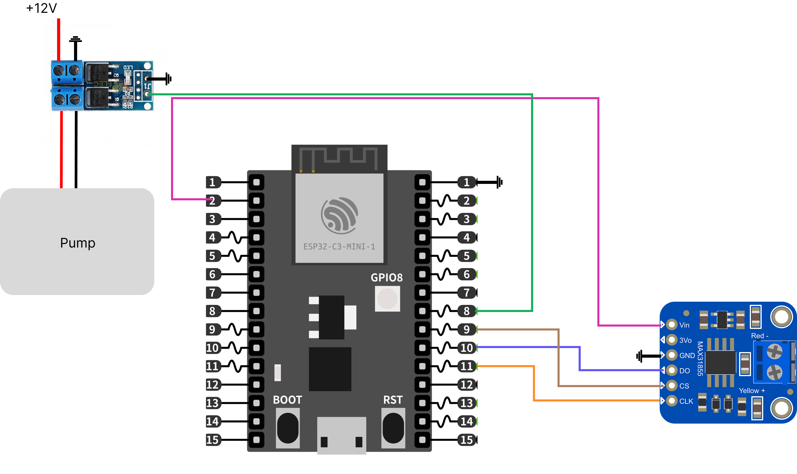

# Printess Temperature Control Loop

This repository contains the resources for the temperature controller including steps for assembly and setting up the control loop mobile application. The following resources will be needed for the loop:

- ESP32 Development Board (we use the ESP32-C3-DevKitM-1 board)
- Adafruit MAX31855 with Thermocouple
- X-Y MOS Mosfet Component
- Pump of choice

You will need the following applications & Frameworks:
- VSCode
- Arduino IDE
- Flutter SDK

## Assembling the temperature controller

To assemble the temperature controller, you need to connect the the MAX31855 thermocouple component to the correct MISO, CLK, and SS pins on the ESP32 board. For the ESP32-C3-DevKitM-1 board the correct connections is shown in the schematic below. Follow the schematic below to assemble the temperature control module. Then, upload the app_control_debug.ino code to the board.

## Downloading the mobile application

To load the mobile application to your device, follow these steps for android and iOS:
https://docs.flutter.dev/testing/debugging

A few resources to get you started if this is your first Flutter project:

- [Lab: Write your first Flutter app](https://docs.flutter.dev/get-started/codelab)
- [Cookbook: Useful Flutter samples](https://docs.flutter.dev/cookbook)

For help getting started with Flutter development, view the
[online documentation](https://docs.flutter.dev/), which offers tutorials,
samples, guidance on mobile development, and a full API reference.
